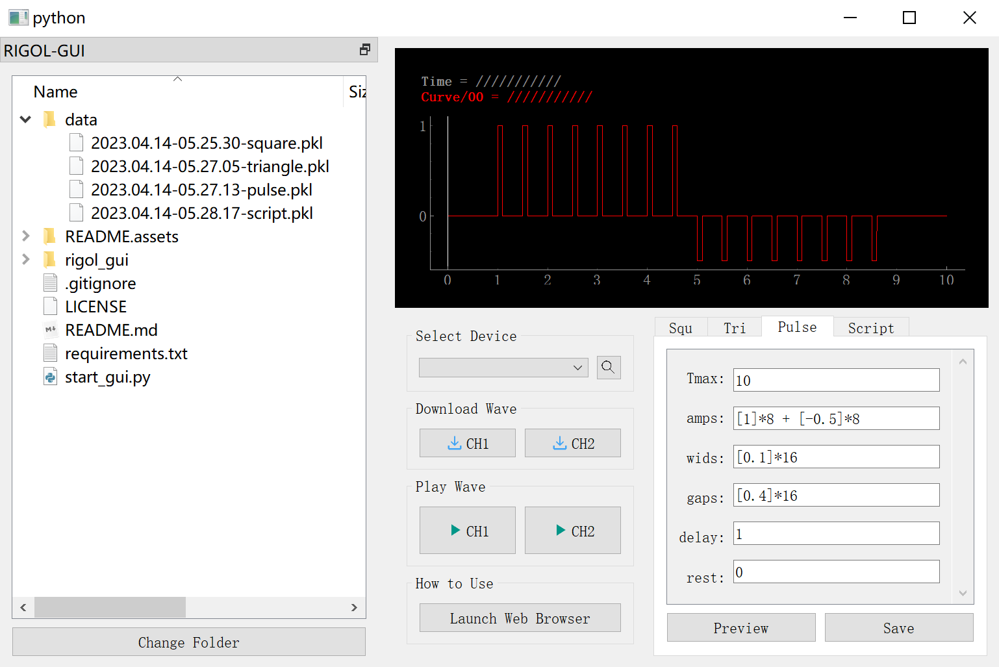

# RIGOL-GUI
* RIGOL-DG系列信号发生器的用户界面，支持DG4000~DG5000系列；
* 使用pyvisa与设备进行通信，界面用PyQt和pyqtgraph包装。




## 安装

* (**前置条件**) 首先安装驱动，可从官网下载[Ultra Sigma (PC)Installer](https://intsso.rigol.com/En/Index/listView/catid/28/tp/5/p/2.html)，或从[网盘](https://pan.baidu.com/s/1ERE6q-mvIvuUgSQR2smAQw?pwd=4202)下载；

* (方式1，win7~win11)

  之后，可以使用已经打包好了的 `exe`程序，请至[releases](https://github.com/hhcaz/RIGOL-GUI/releases)页面下载`RIGOL5000.zip`，解压后可以看到 `RIGOL5000.exe`，双击运行即可，如下图：

  

  **注：**使用时，请确保`RIGOL5000.exe`与`_internal`文件夹处于同一目录下！

* (方式2)

  或者你已经安装好了Python，并且希望通过脚本方式运行，那么需要以下依赖，可通过pip安装: 
  
  ```
pip install numpy pyvisa-py PyQt5==5.15.9 pyqtgraph==0.12.3
  ```

  安装好后，克隆本仓库，输入 `python start_gui.py`启动界面。


## 基本用法

大致分为四步:

1. 点击搜索按钮（可能会卡3秒左右），在下拉框中选择设备的地址，大概长这样：USBx::xxx::DGxxx::INSTR。若未搜索到设备，请检查：1）是否安装Ultra Sigma；2）电脑与信号发生器是否连接。其中设备名称"Dummy Rigol Device"代表虚拟的设备，供程序调试用，对其输出波形不会对实际设备产生任何效果；
2. 设置波形参数（比如幅值，脉宽等），点击"Preview"按钮预览波形；此步骤可先于步骤1；
3. 点击"Download Wave"中的按钮，将波形下载至通道1或通道2，此时信号发生器界面显示的波形应当与当前界面预览显示的波形一致；
4. 点击"Play Wave"中的按钮，控制信号发生器 开始/停止 输出波形。

<p align="center">

</p>


## 波形参数解释

目前支持四种波形：Squ-方波，Tri-三角波，Pulse-脉冲（比Squ自由度高些），Script-自定义。

#### 1. Squ：方波


* Tmax：波形总时长，单位（s）；如果超过该时长后，未手动停止输出，信号发生器会循环输出显示的波形；
* upper：高电平幅值，单位（V）；
* lower：低电平幅值，单位（V）；
* freq：频率，单位（Hz）；
* duty：方波高电平的占空比，取值`[0, 1]`；
* cycle：重复的周期个数；
  * 如果设置为-1，则一直填充至Tmax结束；
  * 如果设置的个数的时间小于Tmax，则剩余时间段的电压为rest；
* delay：延迟时间，单位（s）；延迟时间段内的电压为rest；
* rest：静息电压，单位（V）。


#### 2. Tri：三角波


* Tmax，freq，cycle，delay，rest的含义与Squ相同；
* upper，lower：三角波电压的上限与下限，单位（V）；
* phase：三角波的相位，取值`[0, 1)`，例如：
  * 当相位为0时，在一个周期内，三角波从lower扫到upper，再扫到lower；
  * 当相位为0.25时，在一个周期内，三角波为：mid->upper->lower->mid，其中mid=(lower+upper)/2；
  * 当相位为0.5时，在一个周期内，三角波从upper扫到lower，再扫到upper。


#### 3. Pulse：逐个配置的方波


* Tmax，delay，rest的含义与Squ相同；
* amps：电压幅值，单位（V）；请以列表的形式指定各个周期内脉冲高电平的幅值，例如：
  * 共5个周期，且各个周期内的幅值逐步递增，可以输入`[0.1, 0.2, 0.3, 0.4, 0.5]`；
  * **注：**内部实现采用了Python的`eval()`函数，因此可以支持列表的乘法（重复）和加法（拼接），例如生成16个脉冲，前8个幅值为1V，后8个幅值为-0.5V，可以输入`[1]*8 + [-0.5]*8`；
* wids：各个脉冲周期内高电平的时间，单位（s）；请同样以列表的形式指定，并确保列表长度与amps一致；
* gaps：各个脉冲周期内低电平的时间，单位（s）；请同样以列表的形式指定，并确保列表长度与amps一致；同时低电平时间段内的电压值为rest；**注：**wids[i] + gaps[i]为第i个脉冲的总时间。


#### 4. Script：自定义波形

该模块内置一个代码编辑器，用于编辑代码生成用户想要的任意波形。样例代码为：

```python
# Example to generate custom wave:
# User need to define the value of `Tmax`
# and implement function `user_impl`.

import math

# Tmax is total time, you can modify the value,
# but do not modify the variable name `Tmax`
Tmax = 10

# Function to calculate desired voltage at given
# timestep `t`, you can modify the implementation,
# but do not modify the function name `user_impl`.
# Note: `t` varies from [0, Tmax)
def user_impl(t):
    if t <= Tmax * 0.1:
        y = 0.0
    elif t <= Tmax * 0.9:
        y = math.sin(t)
    else:
        y = 1.0
    return y
```

此代码将生成如下图所示的波形，其中波形时长为10s（由Tmax指定），在前1s内输出0V，在1s至9s内按照正弦波输出波形，在9s至10s内输出1V。


**注：**

* 代码需满足Python语法；
* 可以改变`Tmax`的值，以及`user_impl`函数的实现内容，但请勿改变变量与函数的名称；
* 传给`user_impl`函数的变量`t`的取值范围为`[0, Tmax)`。


## 波形的保存与加载

* 波形保存：在各类波形的参数配置面板有"Save"按钮，点击后可以选择目录进行保存，生成后缀为`.pkl`的文件，内部包含了波形数据以及生成该波形的参数；
* 波形加载：在左侧的dock中点击"Change Folder"，选择之前保存的波形所在的文件夹。之后会显示出该文件夹下的所有文件，双击保存的波形文件就会跳转到生成该波形的参数配置面板，并预览该波形。


